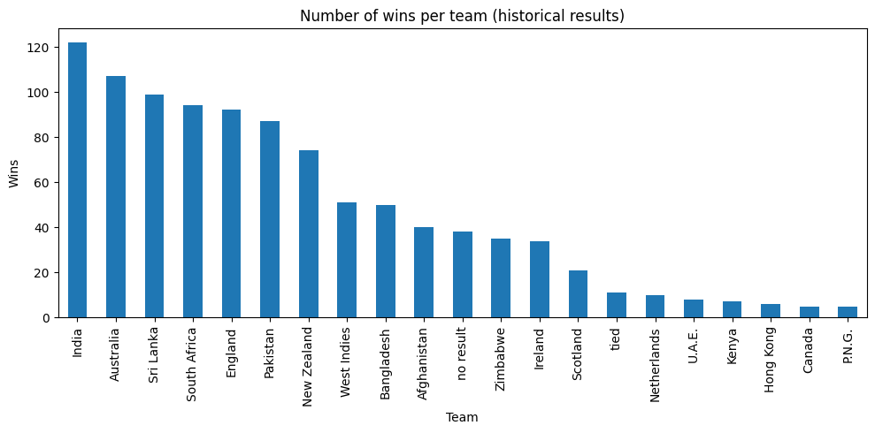

# Cricket Match Winner Prediction for the World Cup 2019

## 📌 Problem Statement
Predict the winner of cricket matches for the World Cup 2019 using team identities and ICC rankings, then simulate league, semi-final, and final outcomes.

---

## 📁 Dataset & Data Handling
* **`results.csv`**: Past international match results with winner labels.
* **`fixtures.csv`**: Scheduled matches in the tournament.
* **`icc_rankings.csv`**: Team rankings used to add positional features.

---

## 🛠 Preprocessing & Approach
* **Preprocessing**:
  * Filter to World Cup teams.
  * Drop irrelevant columns (`date`, `Margin`, `Ground`).
  * One-hot encode `Team_1` and `Team_2` into binary features.
* **Approach**:
  * Train/test split using `train_test_split` (70/30).
  * Logistic Regression as baseline classifier.
  * Generate predictions for league stage, semi-finals, and finals via `predict_result` function.

---

## 📊 Results
* Training accuracy and testing accuracy are printed by the script.
* *Note: Training accuracy higher than testing accuracy suggests some overfitting due to small dataset size and simple model.*

---

### Exploratory Analysis

The historical results show how often each team wins in ODI matches used for this project:



India, Australia, and Sri Lanka have the highest win counts, while emerging teams like Afghanistan and Bangladesh win less often. This provides context for the model’s predicted probabilities and tournament simulation.

---

## Limitations & Future Work

- Uses match results up to the 2019 World Cup only; does not incorporate more recent performance.
- Features are limited to team identities and ICC rankings; no venue, recent form, or player-level statistics.
- Training accuracy (~0.72) is higher than testing accuracy (~0.59), indicating some overfitting on this small dataset and simple model.

Future improvements:

- Incorporate more recent match data from public cricket datasets (e.g. Cricsheet) and retrain the model.
- Evaluate alternative models (e.g. tree-based ensembles) and use cross-validation to better estimate generalization performance.

## 🚀 How to Run

### Local Setup
```bash
# Set up virtual environment
python -m venv venv
source venv/bin/activate  # On Windows: venv\Scripts\activate

# Install dependencies
pip install -r requirements.txt

# Run prediction script
cd src
python prediction.py
